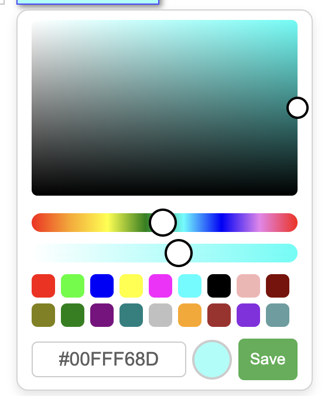
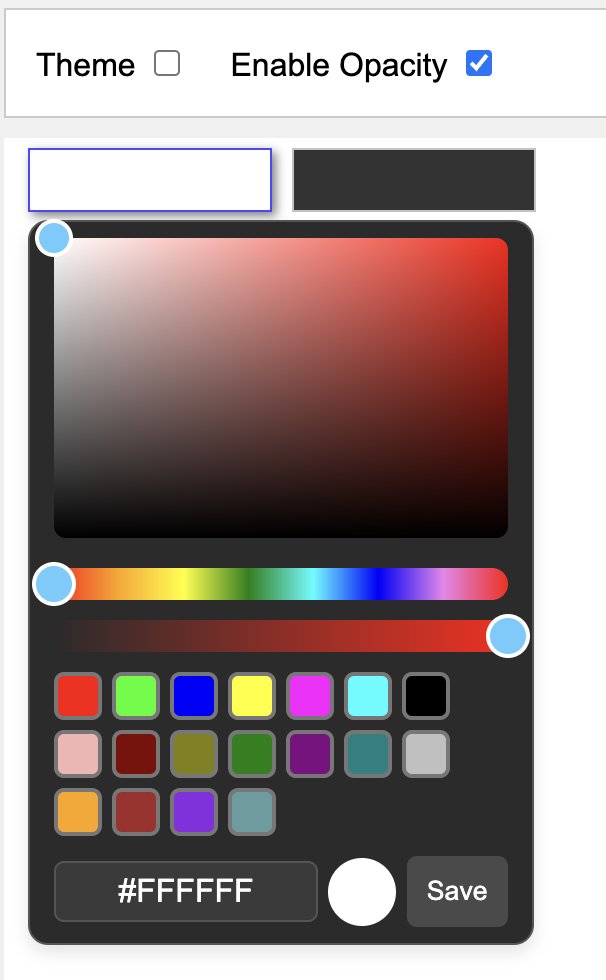

# Custom Color Picker

A lightweight and customizable JavaScript color picker, designed to replace the default browser-native color picker with a more flexible and visually appealing alternative.

---

## Features

- **Customizable UI** for a better user experience.
- **Real-time color preview** and updates as you select a color.
- **Lightweight** and easy to integrate into any project.
- Fully **responsive** and **mobile-friendly** design.
- Custom **themes** (light/dark).

---

## Installation

### 1. Clone the repository

Clone or download the repository to your local machine.

```bash
git clone https://github.com/sathishkrish58/color-picker.git
```
---

### 2. Include required files

Add the following lines to include the necessary CSS and JS files into your project:

```
<link rel="stylesheet" href="./picker.css">
<script src="./picker.js"></script>
```
---
## Usage

### 1. Initialize the color picker in JavaScript

Create an instance of the color picker in your JavaScript code:

```javascript
colorPicker.init({
    container: 'containerlement,
    "opacity_enabled": true
})
```

### 2. Customize the appearance and behavior

You can customize the color picker with options like initial color, supported color formats, and theme:

```javascript
colorPicker.init({
    container: document.getElementById('colorPickerContainer'),
    formats: ['hex', 'rgb'], // Color formats supported
    theme: 'dark', // Use dark theme for the picker
    opacity_enabled: false
    onChange: (color) => {
        document.body.style.backgroundColor = color; // Apply color to body background
    },
});
```
---

## Screenshots

<div style="display: flex; justify-content: space-between;">


</div>
