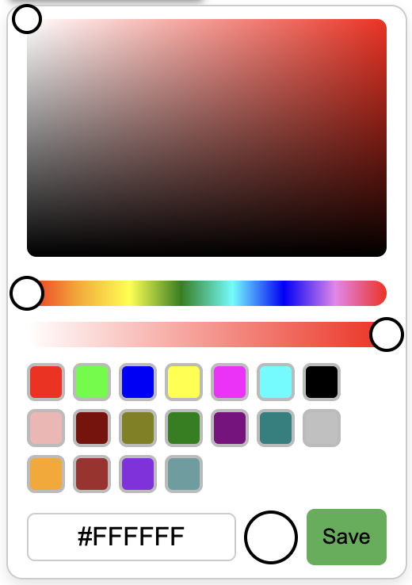
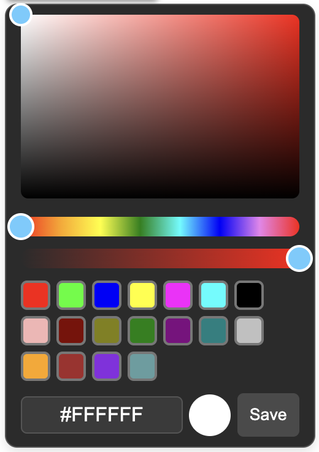

# Custom Color Picker

A lightweight and customizable JavaScript color picker, designed to replace the default browser-native color picker with a more flexible and visually appealing alternative.

---

## Features

- **Customizable UI** for a better user experience.
- **Real-time color preview** and updates as you select a color.
- **Lightweight** and easy to integrate into any project.
- Fully **responsive** and **mobile-friendly** design.
- **Light and Dark Mode Support**: Users can toggle between light and dark themes.
- **Optional Opacity Adjustment**: A slider to adjust the opacity (can be toggled on/off).
- **Save Button**: Saves the selected color.


## Installation

### 1. Clone the repository

Clone or download the repository to your local machine.

```bash
git clone https://github.com/sathishkrish58/color-picker.git
```
---

### 2. Include required files

Add the following lines to include the necessary CSS and JS files into your project:

```
<link rel="stylesheet" href="./picker.css">
<script src="./picker.js"></script>
```
---
## Usage

### HTML Structure

```html
<div class="native-color-picker">
    <input type="color" value="#ffffff">
</div>
```

### Initialize the color picker in JavaScript

Create an instance of the color picker in your JavaScript code:

```javascript
colorPicker.init({
    theme: 'light',
    container: 'containerlement,
    opacity_enabled: true
})
```

### Optional Opacity Slider

To enable or disable the opacity slider

```javascript
    opacity_enabled: false
```

### Customize the appearance and behavior

You can customize the color picker with options like initial color, supported color formats, and theme:

```javascript
colorPicker.init({
    container: document.getElementById('colorPickerContainer'),
    formats: ['hex', 'rgb'], // Color formats supported
    theme: 'dark', // Use dark theme for the picker
    opacity_enabled: false
});
```
---

## Screenshots

<div style="display: flex; justify-content: space-between;">



</div>

## Contribution

Contributions are welcome! Feel free to open issues or submit pull requests to enhance the functionality or fix bugs.

## License

This project is open-source and licensed under the [MIT License](LICENSE).